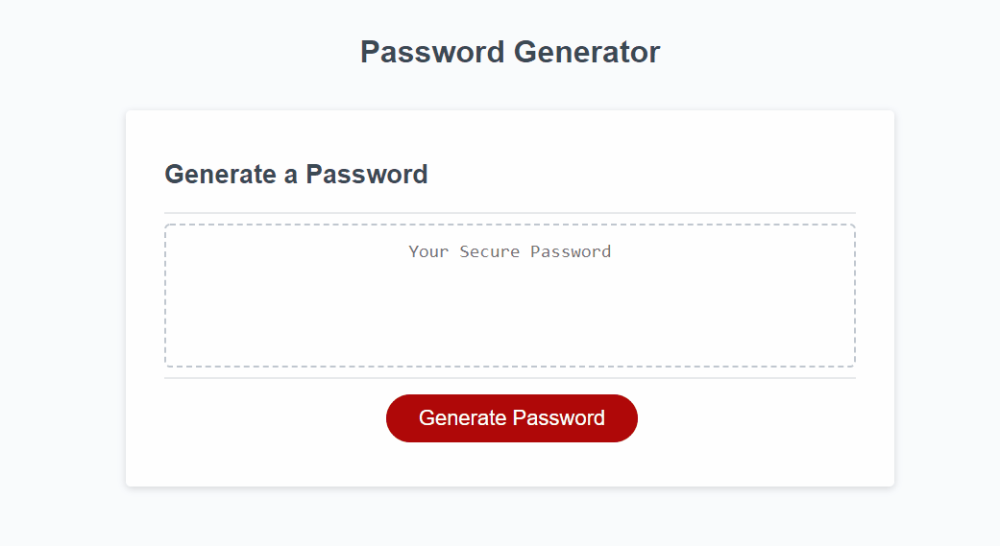

# adrianos-password-generator

Homework 3 - Password Generator

JavaScript

## HOMEWORK LINKS

* GitHub Repository [GitHub repository link](https://github.com/AdrianoArmen/adrianos-password-generator-3) 

* Website Deployed [Website Deploy link](https://adrianoarmen.github.io/adrianos-password-generator-3/) 

## Description

This sample app was designed to showcase my JavaScript fundamentals. The scenario required developing a simple password generator in which the user had to select the type of characters and password length on prompts before getting a random value on the text box. I had to use many variables and functions in order to check all the acceptance criteria of this exercise. Coding best practices and functionality comments can be found on the JS file.

## Screenshots

* Mockup:

* App Functionality:

## License 📄

This project is licensed under the MIT License - see the [LICENSE.md](LICENSE.md) file for details

---

© 2021 Adriano.

